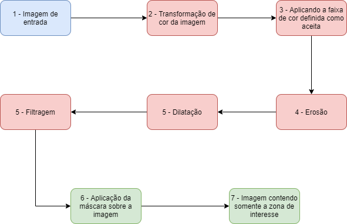

# Detecção de pele usando OpenCV
> Este trabalho descreve a implementação de um algoritmo que reconheça as tonalidades de cores da pele humana através do processamento de imagem. A biblioteca do OpenCV foi utilizada para o processamento e manipulação da imagem. O processo de detecção utilizado nesse trabalho, consiste na varredura dos pixels da imagem, comparando com uma faixa de cores previamente já definida para a tonalidade da cor da pele. Foram utilizados dois modelos de cores a fim de comparações, sendo eles: HSV e YCrCb.

## Algoritmo de detecção de pele

A primeira parte do fluxo do algoritmo se dá pela leitura e transformação da imagem de entrada, como pode ser vista de acordo com os passos 1 e 2 da figura acima.
Após a imagem ser lida, ela deverá ser convertida para um dos modelos de cores escolhidos (HSV ou YCrCb) para testes. O modelo HSV é um modelo de cores onde são formados pelos componentes de matiz (tonalidade), saturação e brilho. O modelo YCrCb, por sua vez, é formado pelo componente de luminância (luma) e, Cb e Cr são os componentes cromados de diferença azul e vermelho.
