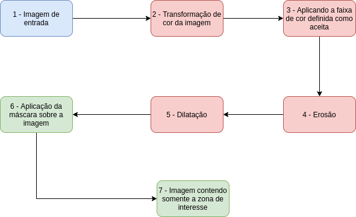

# Detecção de pele usando OpenCV
> Este trabalho descreve a implementação de um algoritmo que reconheça as tonalidades de cores da pele humana através do processamento de imagem. A biblioteca do OpenCV foi utilizada para o processamento e manipulação da imagem. O processo de detecção utilizado nesse trabalho, consiste na varredura dos pixels da imagem, comparando com uma faixa de cores previamente já definida para a tonalidade da cor da pele. Foram utilizados dois modelos de cores a fim de comparações, sendo eles: HSV e YCrCb.

## Algoritmo de detecção de pele

A primeira parte do fluxo do algoritmo se dá pela leitura e transformação da imagem de entrada, como pode ser vista de acordo com os passos 1 e 2 da figura acima.
Após a imagem ser lida, ela deverá ser convertida para um dos modelos de cores escolhidos (HSV ou YCrCb) para testes. O modelo HSV é um modelo de cores onde são formados pelos componentes de matiz (tonalidade), saturação e brilho. O modelo YCrCb, por sua vez, é formado pelo componente de luminância (luma) e, Cb e Cr são os componentes cromados de diferença azul e vermelho.

Quando utilizado o modelo de cor HSV para as transformações das cores da imagem, foram definidos uma faixa de cor que detecte o máximo de pele humana. A faixa definida de aceitação é composta de o mínimo de matiz utilizado foi H = 0, até o máximo de H = 22 de intensidade. A saturação vai de no mínimo de S = 25, até o máximo de S = 180. E por último, o nível de brilho vem de no mínimo V = 37, até o máximo de V = 255.

Utilizando o modelo de cor YCrCb, assim como no modelo HSV, foram definidas também faixas de tonalidades que reconheça a tonalidade da pele humana. A faixa definida para a aceitação da pele humana foi de no mínimo de luma Y = 0, até o máximo de Y = 255. O componente Cr com o mínimo definido com Cr = 129, até o máximo definido com Cr = 255. E por último, o componente Cb definido com no mínimo de Cb = 93, até o máximo de Cb = 180.

Após a imagem ser transformada para um modelo de cor (HSV ou YCrCb), e tendo suas faixas de aceitação de cores já definido para modelo o modelo escolhido, é hora de gerar a máscara da pele. A primeira parte da geração da máscara, seria a varredura de toda a imagem, extraindo as zonas que estão dentro da faixa de aceitação das cores da pele. Após a extração dessas zonas da imagem, a máscara gerada passará por um processamento de erosão e dilatação, onde são métodos contido na biblioteca do OpenCV. A erosão trata-se de um método que desgasta os limites do objeto em primeiro plano, então, o kernel desliza pela imagem e será considerado 1 apenas se todos os pixels sob o kernel forem 1, caso contrário é corroído (reduzido a 0). A dilatação, por sua vez, é o oposto da erosão. Nela, um elemento de pixel 1 será considerado se pelomenos um pixel sob o kernel for 1, assim, aumentando a região branca da máscara. Normalmente, a erosão é seguida pela dilatação, porque a erosão remove os ruídos brancos, mas também encolhe o objeto, então, usa-se a dilatação. Como o ruido acabou, para aumentar a área do objeto.

Após o processo de tratamento da máscara, passando pela transformação de cor, pelos filtros de erosão e dilatação, é gerada uma nova imagem a partir da máscara. Nessa imagem construída contém somente os pixels que se encontram dentro da faixa de aceitação, ou seja, somente as zonas de interesse. Fora dessa faixa, os pixels foram transformados para 0.

## Resultados da detecção
Abaixo pode ser visto os resultados obtidos. Tem-se, respectivamente, os resultados com o modelo de cor HSV e por seguinte, os resultados com o modelo de YCrCb.

